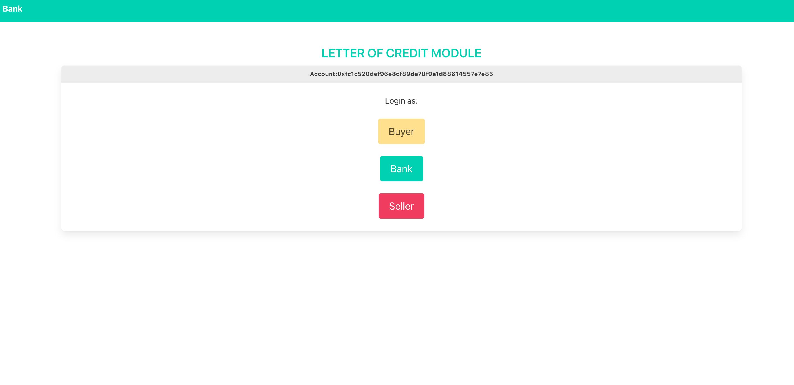
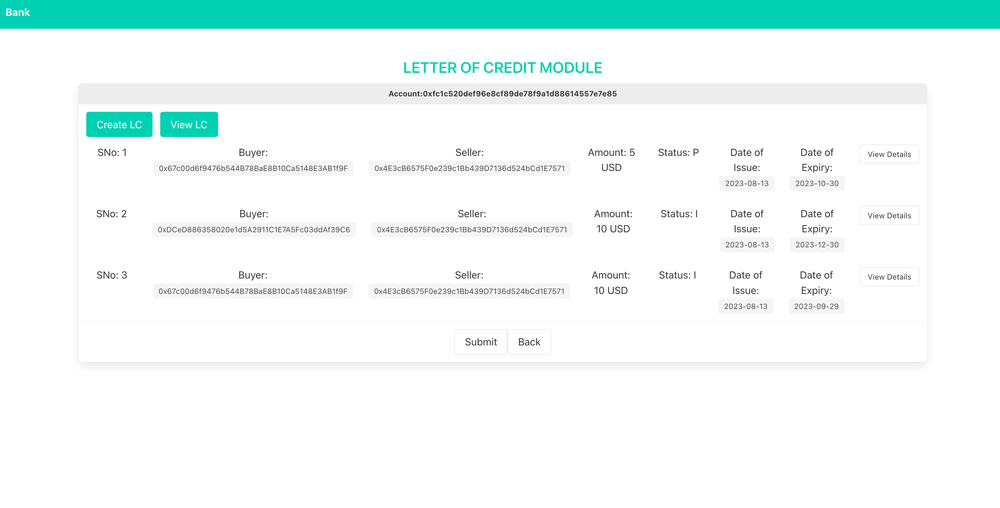
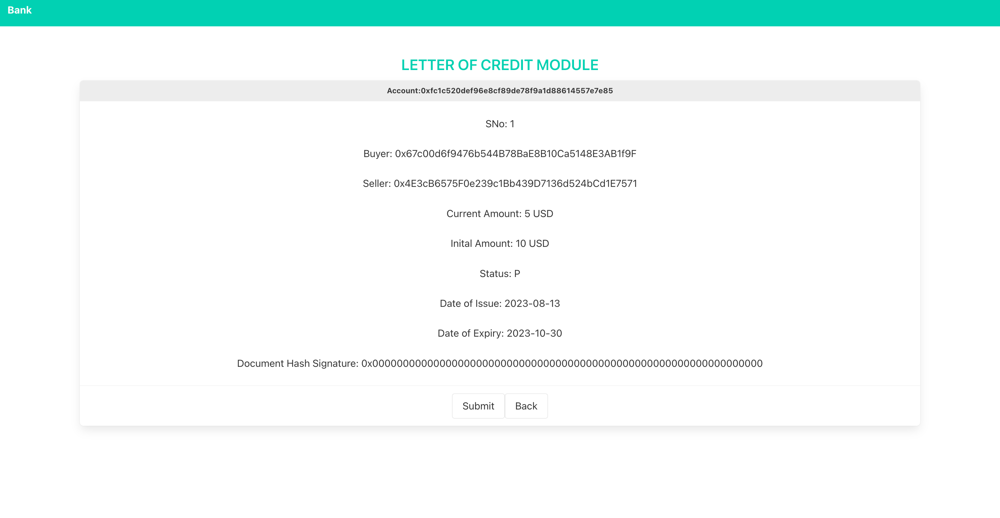
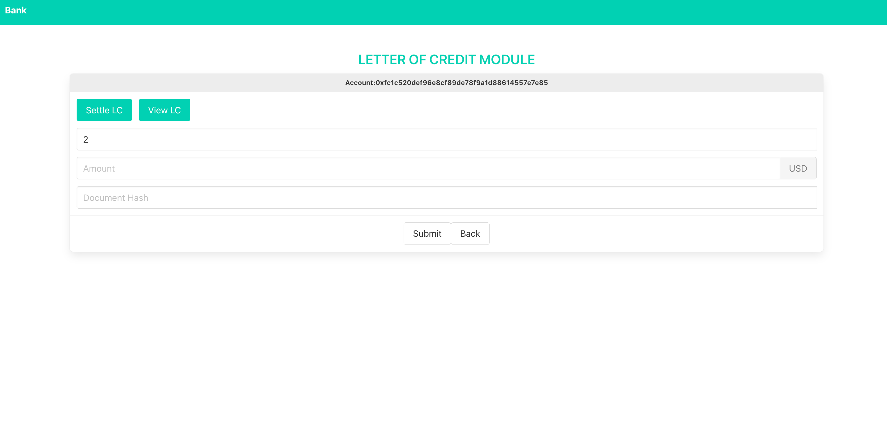

<!-- PROJECT SHIELDS -->

[![Forks][forks-shield]][forks-url]
[![Stargazers][stars-shield]][stars-url]
[![Issues][issues-shield]][issues-url]
[![MIT License][license-shield]][license-url]
[![LinkedIn][linkedin-shield]][linkedin-url]
[![Follow on GitHub][github-shield]][github-url]

# 📜 Smart Contract Letter of Credit Module

This repository demonstrates how smart contracts and blockchain can revolutionize traditional financial instruments like the letter of credit (LC) in international trade transactions. Leveraging the immutable and transparent nature of blockchain, the included smart contracts and React app aim to streamline the LC process, reducing both potential errors and fraud risks.

The project consists of:

- Smart Contracts: USD token contract, LC Manager contract, and an LC contract.
- React App: An interactive user interface to facilitate operations on these smart contracts for various roles like the bank, buyer, and seller.

For a deeper dive into the underlying concepts and motivations, read [Medium](https://medium.com/better-programming/building-enterprise-grade-workflows-with-smart-contracts-on-blockchain-6fa559a8110).

## Table of Contents

1. Overview
2. Components
3. Smart Contracts
4. React App
5. Getting Started
6. Usage
7. Contributing

<p align="right">(<a href="#top">back to top</a>)</p>

## Overview

This module focuses on the LC process, traditionally involving three key players: the buyer, the seller, and the bank. The bank acts as a mediator, extending credit to the buyer while guaranteeing payment to the seller once conditions are met. By employing smart contracts, we've managed to encapsulate and automate this process in a decentralized manner.

The steps to set up the LC workflow include:

1. Developing and deploying the USD asset contract as a fungible asset using the ERC20 standard.
2. Linking the USD token with the LC Manager and LetterOfCredit smart contracts.
3. Setting up and deploying the LC Manager contract.
4. Creating a user-friendly React application to handle LCs.
5. Running and evaluating the entire setup.

</img>
</img>
</img>
</img>

<p align="right">(<a href="#top">back to top</a>)</p>

## Components

This repository contains the following components:

- `contracts/`: Contains the solidity smart contract files for the USD Token, LC Manager, and LetterOfCredit.
- `scripts/`: Contains the deployment script for deploying the contracts to the blockchain.
- `src/`: Contains the React application files.
- `test/`: Contains the tests for the smart contracts.

## Smart Contracts

The smart contracts used in this project include a USD token contract, an LC Manager contract, and an LC contract. These contracts work together to automate the LC process and ensure accountability for all parties involved in the transaction.

- The USD token contract is an ERC20 token that is used to represent the value of the LC. The token is pegged to the US dollar and is used to facilitate payments between the Buyer, Seller, and bank.

- The LC Manager contract is responsible for creating new LCs, managing their lifecycle, and ensuring that all parties involved in the transaction are held accountable.

- The LC contract represents a single LC and contains all the details of the transaction, including the parties involved, the value of the LC, and the terms of the transaction.

<p align="right">(<a href="#top">back to top</a>)</p>

## React App

LC Module React App
The React app provides a frontend layer for interacting with the smart contracts, and has the following users and features:

- `Bank`: The bank user who logs in to the app. The user can create and view LCs.
- `Buyer`: The buying merchant who requests an LC from the bank. The Buyer can view all the LCs issued in their name by the bank.
- `Seller`: The selling merchant who will approach the bank for settlement, on the successful delivery of their goods to the buying merchant. The Seller can view the LCs that include them as a beneficiary and submit a settlement request.

The app has the following React components:

- `Address Bar`: Displays the account used to access the app in real-time.
- `Description`: Provides a description of the app.
- `Nav`: Implements a navigation bar, with the bank's name and logo.
- `InputField`: Implements the input fields used for getting inputs from the user.
- `Container`: Links the main App.js file and the rest of the child components. It renders child components based on the current state. It receives all state variables and methods and forwards them to the child components, as and when required.
- `Bank Login`: A login screen for our bank. It allows the Buyer, the Seller, and the bank to log in to the app and use it. It also redirects them to the lower screens, for using the app.
- `BankTabCreate`: Renders the Create LC screen for the bank user.
- `BankTabView`: Renders the View LC screen for the bank user.
- `BuyerTabView`: Renders the View LC screen for the Buyer.
- `SellerTabSettle`: Renders the Settle LC screen for the Seller.
- `SellerTabView`: Renders the View LC screen for the Seller.
- `LCView`: Renders a singular screen, with all the details of a single LC. It can be accessed by the bank user, the Buyer, or the Seller.

The React app provides a basic interface for interacting with the smart contracts. It allows the Bank, Buyer, and Seller to perform their respective roles in the LC process.

<p align="right">(<a href="#top">back to top</a>)</p>
## Getting Started

To get started with the project, follow these steps:

1. Clone the repository

```
git clone https://github.com/ac12644/Smart-Bank-LC-Workflow.git
```

2. Install the required dependencies

```
npm install
```

3. Deploy the smart contracts on your local blockchain network (e.g., Polygon Mumbai)

```
npx hardhat run scripts/deploy.js --network mumbai
```

4. Update the ABIs

After deploying your contracts, you'll need to replace the existing ABIs in the project with the ones from your deployed contracts. You can retrieve the new ABIs from the `artifacts/contracts` directory.

- For the LetterOfCredit contract, replace the ABI in `src/contracts/LCabi.js` with the ABI of your deployed contract.

- For the LCManager contract, replace the ABI in `src/contracts/LCManager.js` with the ABI of your deployed contract.

5. Run the app:

```
npm start
```

<p align="right">(<a href="#top">back to top</a>)</p>

## Usage

Once you have started the React app, you can access it at http://localhost:3000. The app has three user types: Bank, Buyer, and Seller. Each user type has specific actions that they can perform, including creating and viewing LCs.

## Contributing

Contributions to the project are welcome. To contribute, follow these steps:

1. Fork the repository
2. Create a new branch (`git checkout -b feature/new-feature`)
3. Make your changes
4. Commit your changes (`git commit -m 'Add new feature'`)
5. Push to the branch (`git push origin feature/new-feature`)
6. Open a pull request

<p align="right">(<a href="#top">back to top</a>)</p>

[forks-shield]: https://img.shields.io/github/forks/ac12644/Smart-Bank-LC-Workflow?style=for-the-badge
[forks-url]: https://github.com/ac12644/Smart-Bank-LC-Workflow/network/members
[stars-shield]: https://img.shields.io/github/stars/ac12644/Smart-Bank-LC-Workflow?style=for-the-badge
[stars-url]: https://github.com/ac12644/Smart-Bank-LC-Workflow/stargazers
[issues-shield]: https://img.shields.io/github/issues/ac12644/Smart-Bank-LC-Workflow?style=for-the-badge
[issues-url]: https://github.com/ac12644/Smart-Bank-LC-Workflow/issues
[license-shield]: https://img.shields.io/github/license/ac12644/Smart-Bank-LC-Workflow?style=for-the-badge
[license-url]: https://github.com/ac12644/Smart-Bank-LC-Workflow/blob/main/LICENSE
[linkedin-shield]: https://img.shields.io/badge/-LinkedIn-black.svg?style=for-the-badge&logo=linkedin&colorB=555
[linkedin-url]: https://www.linkedin.com/in/ac12644/
[github-shield]: https://img.shields.io/github/followers/ac12644?label=Follow&style=for-the-badge
[github-url]: https://github.com/ac12644
